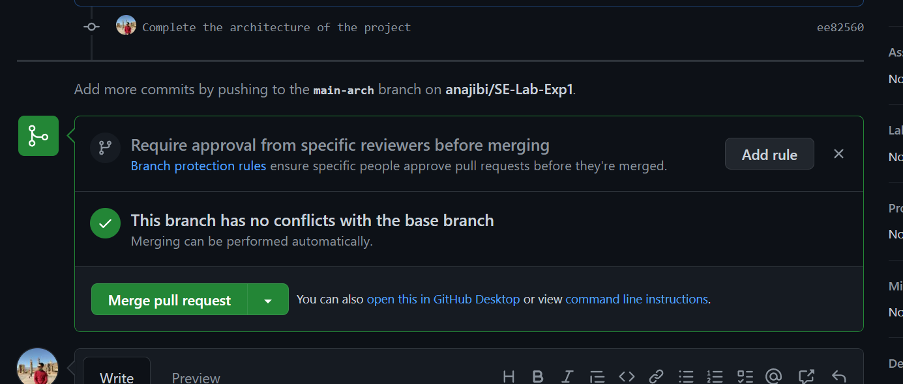
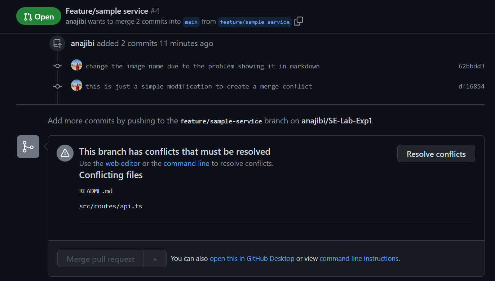
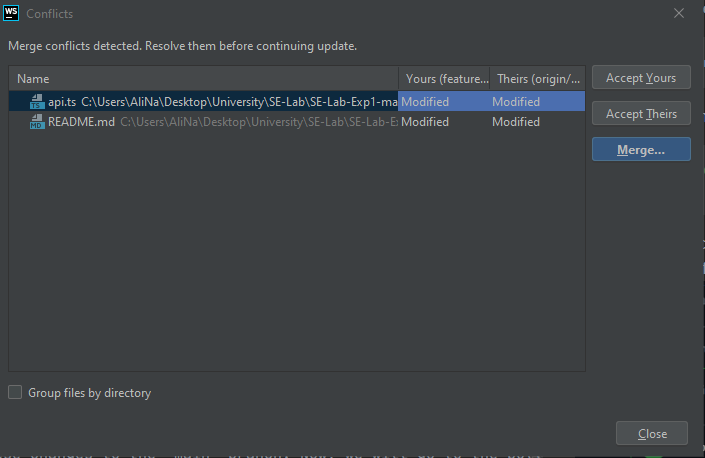
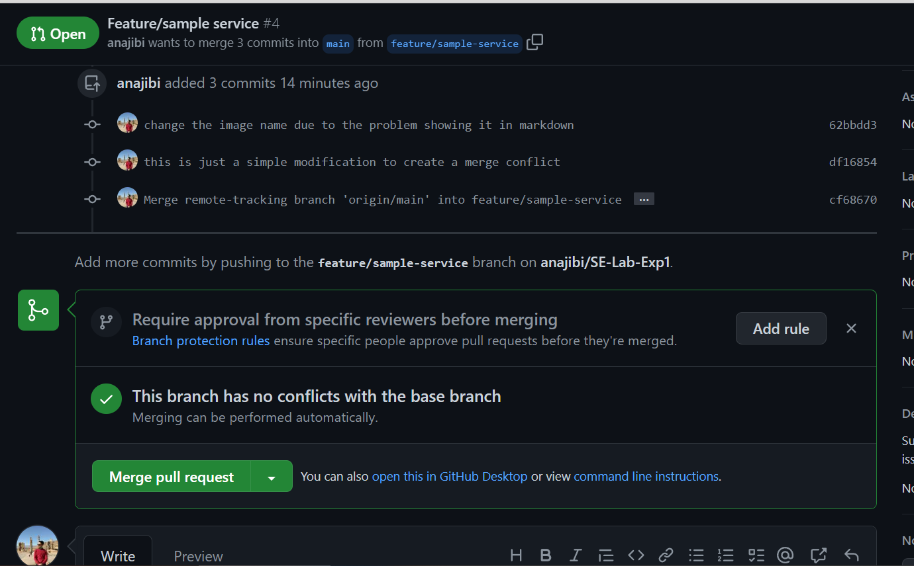
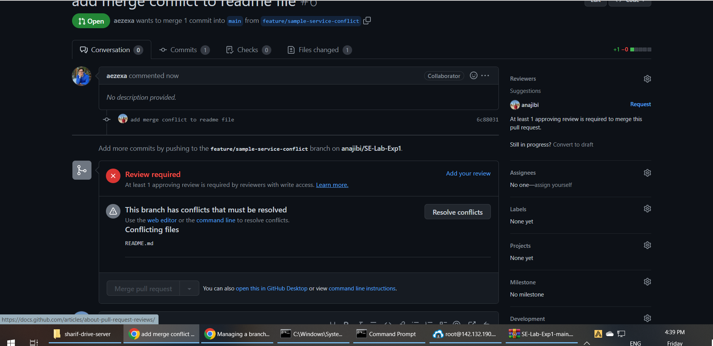
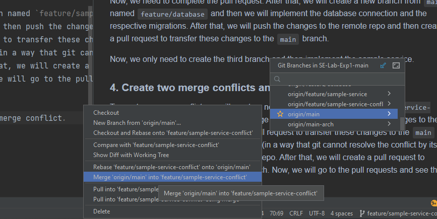
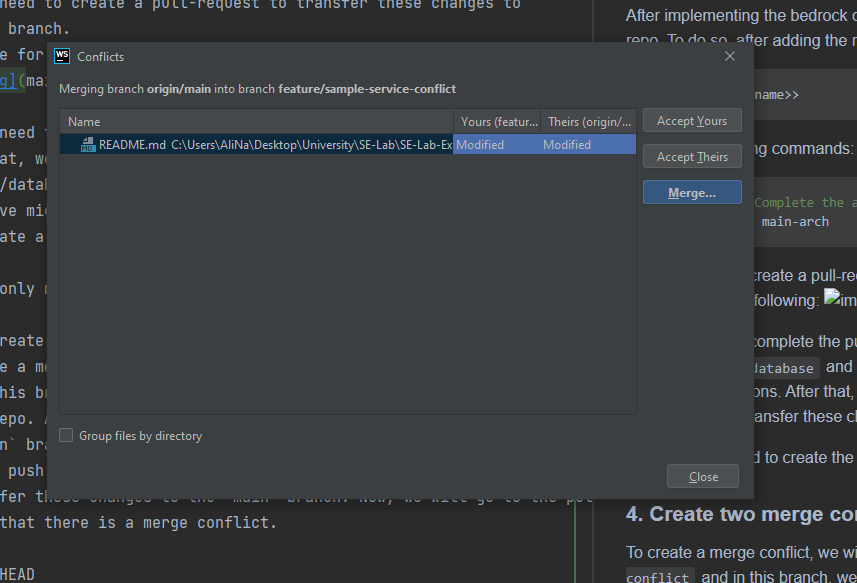
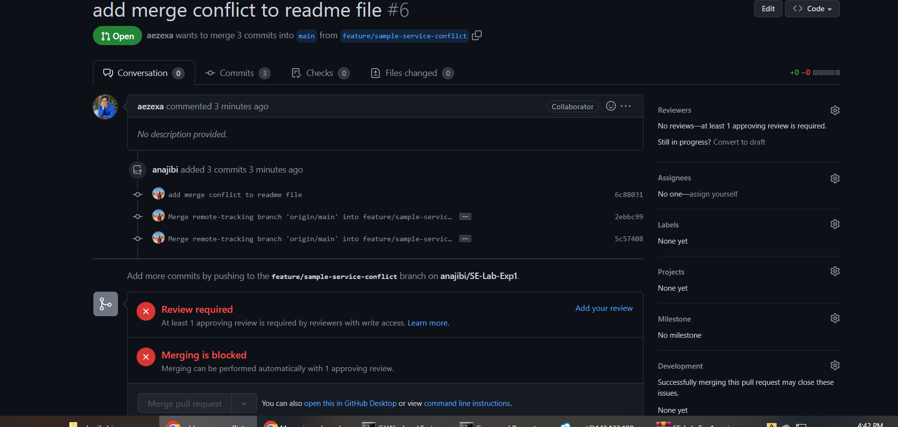

# SE-Lab-Exp1
### Student Numbers:
- Ali Najibi - 98106123
- Alireza Honarvar - 98102551

## About the project:
This project is the back-end part of a google-cloud like service. This service is
responsible for managing the storage of the user's files and also the user's
resources.

## Report:
### 1. Create the git repo and clone it into your local machine
To achieve this, we first need to create a new git repository in [github](githbu.com) and then clone it into our local machine. To do so, we need to run the following commands in the terminal:
```bash
git init
git clone <<url>>
```
Now, since we have the repo in our local machine, we can start working on it.
### 2. Protect the `main` branch
To do so, we need to go to the repo's settings and then go to the `Branches` section. In this section, we need to check the `Protect this branch` checkbox.
It will navigate us to a page where we can select the rules we want to apply to this
branch, we will select the following:
- Require pull request before merging
    - Require approval
- Do not allow bypassing the above settings

And then we will click on the `Save changes` button. Now, we have protected the `main` branch.


### 3. Create different branches for each feature
We have 3 features that are independent of each other, these features and their
corresponding branches are as follows:
1. Architecture: `main-arch`
2. Database connection and respective migrations: `feature/database`
3. A sample service and respective endpoints: `feature/sample-service`

It's important to know that since the architecture branch is the foundation for the
whole project, it's initialized first and after it's merged into the `main` branch,
the other two branches are initialized and then merged into the `main` branch when their development is done.
To do that, we first run the following command:
```bash
git checkout -b main-arch
```
After implementing the bedrock of the project, we need to push the changes to the
remote repo. To do so, after adding the required files with 
```bash
git add <<file-name>>
```
we run the following commands:
```bash
git commit -m "Complete the architecture of the project"
git push origin main-arch
```
Now, we need to create a pull-request to transfer these changes to 
the main branch.
The image for this part is the following:


Now, we need to complete the pull request.
After that, we will create a new branch from `main` named 
`feature/database` and then we will implement the database connection and the
respective migrations. After that, we will push the changes to the remote repo and
then create a pull request to transfer these changes to the `main` branch.

Now, we only need to create the third branch and then implement the sample service.

### 4. Create two merge conflicts and resolve them
To create a merge conflict, we will create a new branch named `feature/sample-service-conflict`
and in this branch, we will change a specific file and then push the changes to the
remote repo. After that, we will create a pull request to transfer these changes to
the `main` branch. Now, we will change the same file (in a way that git cannot resolve the conflict by itself)
and then push the changes to the remote repo. After that, we will create a pull request
to transfer these changes to the `main` branch. Now, we will go to the pull requests
and see that there is a merge conflict.

After firstly merging branch `feature/sample-service-conflict` using a pull request,
we will try to merge branch `feature/sample-service` using a pull request. And we see 
the following in the pull request page in github:


Since it is much easier to resolve conflicts on the idea, we try to merge `main` into
our local feature branch `feature/sample-service` and we see the following:

After resolving these conflicts, we push the branch `feature/sample-service` to the remote repo
and see the following in the pull request page:

This indicates that the merge conflict is resolved and we can merge the branch `feature/sample-service`
into the `main` branch.

#### Merge conflict 2
To create the second merge conflict, we will 
do the same thing as the first merge conflict. I would like to take a moment 
and explain more about merge conflicts and how they are caused and how we create them:
A merge conflicts happens when git cannot decide how a file should look like
after a merge, it usually happens when two branches start from the same commit
and change the same file. In this case, git cannot decide which changes should
be kept and which ones should be discarded. To resolve this, we need to manually
resolve the conflict and then push the changes to the remote repo.

Now, lets walk you through what I do, I firstly sync both branches
`feature/sample-service-conflict` and `feature/sample-service` with the `main` branch so 
the branches are up to date and start from the same commit. After that, I change the same file
in both branches and then push the changes to the remote repo. Then, I create a pull request
to transfer the changes from `feature/sample-service-conflict` to the `main` branch. Now, when the other
branch (`feature/sample-service`) tries to merge the `main` branch, it will see a merge conflict since
the file has been already changed in the `main` branch (due to the fact that the commit 
containing the change exists in the `main` branch because of the pull request from the
`feature/sample-service-conflict` branch).

Images for the second merge conflict is as follows:
- The following is the image of the conflict:

- The following is the image of the step where we try to merge `main` into 
my local branch `feature/sample-service-conflict` and we see the conflict:


- The following is the image of the conflict after resolve:



## Answer to the questions:
1. What is the `.git` folder? What information is being saved on it? How is it created?
   The .git folder is the directory at the root of a Git repository, and it is where Git stores all the metadata and information about the repository. 

  This folder contains all the information necessary for Git to track changes in your project over time and manage your version control. Inside the .git folder, you'll find various files and subdirectories that store information such as:
- Object database: This is where Git stores all the snapshots of your files and directories. These snapshots are called "objects" in Git terminology.
- Branches: Git stores information about the branches you have in your repository, including the name of the branch, the commit it points to, and any commits that are ancestors of that commit.
- Configuration: Git stores your configuration settings, such as your username and email address.

- Hooks: Git allows you to specify scripts that should run before or after certain Git actions. These scripts are stored in the .git/hooks directory.

- Refs: Git stores references to commits, tags, and branches in the .git/refs directory.

The .git folder is created automatically when you initialize a new Git repository. You can do this by running the 
```bash
git init
```
command inside your project's root directory. Once you run this command, Git creates the .git directory and sets up all the necessary files and directories inside it. If you clone a Git repository from a remote server, the .git directory will be included in the cloned repository.

2. What does `atomic` mean in the context of `atomic commit` and `atomic pull-request`?
- Commits being atomic means that all changes of teh commit are considered to be applied together
and you cannot have some parts of a commit applied and some parts discarded, any change that is commited in
a single commit should be applied together. This is important because it allows us to revert a commit
and to contain the integrity of the codebase.

- Similarly, in the case of an atomic pull request, it means that the changes being proposed in the pull request are a single, indivisible unit that can be merged into the target branch in one operation. An atomic pull request ensures that all changes are applied together as a coherent set, rather than piecemeal, which can help prevent errors and conflicts.

3. What is the difference between `fetch`, `pull` and `merge`?

`fetch`, `pull`, and `merge` are all Git commands used to update a local repository with changes from a remote repository. 
Here are the differences between these commands:

- `fetch`: `git fetch` downloads changes from a remote repository to the local repository, but does not merge them with the local branch. 
It only updates the remote-tracking branches in the local repository. This means that after running git fetch, 
you can see what has changed on the remote branch without changing anything in your local branch.

- `pull`: `git pull` is used to fetch changes from the remote repository and merge them with the local branch. 
It is essentially a combination of `git fetch` and `git merge`. This means that after running git pull, 
your local branch will be updated with the changes from the remote branch.

- `merge`: `git merge` combines changes from one branch into another. 
This is useful when you want to incorporate changes from another branch into your current branch. 
For example, if you have created a feature branch and want to merge it into the main branch, you would use `git merge`.

In summary, `fetch` and `pull` are used to download changes from a remote repository, 
while `merge` is used to incorporate changes from one branch into another. 
The key difference between `fetch` and `pull` is that `fetch` only downloads changes and does not merge them,
while `pull` downloads changes and merges them into the local branch.

4. What is the difference between `reset`, `revert`, `rebase`, and `restore` in git?
   
In Git, there are several commands that are commonly used to manage changes to a repository's history.
While some of these commands may seem similar, each has a unique purpose and use case.
Here's a brief overview of the differences between reset, revert, rebase, and restore:

- Reset: The `git reset` command is used to move the current branch to a specific commit,
effectively resetting the branch to that point in history. 
This can be useful for discarding local changes or undoing a previous commit. 
Git reset can be used with different flags to determine how it affects the working directory and staging area.

- Revert: The `git revert` command is used to create a new commit that undoes the changes made by a previous commit. 
Unlike reset, revert creates a new commit that contains the inverse changes of the commit being reverted,
which preserves the repository's history. Revert can be used to undo a specific commit, or a range of commits.

- Rebase: The `git rebase` command is used to integrate changes from one branch into another by reapplying commits on top 
of another branch. This can be useful for keeping a clean history, avoiding merge commits, and resolving conflicts in a 
more streamlined way than merging. Rebase can be a complex operation and requires careful consideration of the impact on 
other team members working on the same codebase.

- Restore: The `git restore` command is used to discard changes in the working directory or staging area. 
This can be useful for undoing changes that haven't yet been committed or reverting changes that were mistakenly added 
to the staging area. Restore can be used with different flags to determine how it affects the working directory and staging area.

5. What does `stage` refer to? What is the responsibility of `stash` command?

The `stage` refers to the process of preparing changes to be committed.
When you make changes to files in a Git repository, Git considers them as "unstaged changes" until you explicitly tell Git
to stage them. Staging is done using the git add command, which adds changes to the staging area, also known as the index. 
Once changes are staged, they can be committed to the repository using the git commit command.

- The `stash` command in Git allows you to temporarily save changes that are not yet ready to be committed,
so that you can switch to a different branch or work on a different task without losing your current changes.
When you run `git stash`, Git saves your changes to a "stash" which is a stack of saved changes.
You can later apply the saved changes using `git stash apply`, `git stash pop`, or `git stash branch`. 
`git stash apply` and `git stash pop` apply the saved changes to the current branch,
while `git stash branch` creates a new branch with the saved changes applied. 
The stash command is particularly useful when you need to switch to a different branch or work on a different task temporarily,
but you don't want to commit incomplete or experimental changes to the repository.


6. What does the concept of `snapshot` mean in the context of Git?

In the context of Git, a snapshot refers to a specific state of the repository at a given point in time. Git is a version control system that tracks changes to files over time and maintains a history of changes. Each time a file is changed, Git creates a new snapshot of the repository that reflects the current state of all files.

Snapshots are created through the process of committing changes to the repository. When you commit changes using the git commit command, Git creates a new snapshot of the repository that reflects the changes you have made since the last commit. This snapshot includes all of the files in the repository, including any new files, modified files, and deleted files.

Each snapshot in Git is identified by a unique identifier called a commit hash, which is a 40-character string of letters and numbers. You can use the git log command to view a list of all commits in the repository, along with their commit hashes, commit messages, and other information.

Snapshots are a key feature of Git because they allow you to track changes to your codebase over time and collaborate with others on a shared codebase without worrying about conflicts or lost changes. By creating snapshots of the repository at each commit, Git makes it easy to roll back changes, compare different versions of the codebase, and collaborate with others on a shared codebase.
